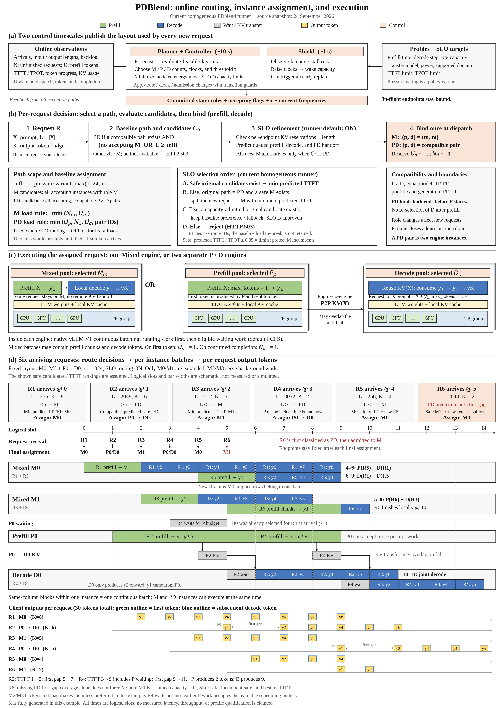

# PDblend 当前在线调度：源码分析与论文风格调度图

本说明核对 **2026-09-24 当前工作树**，主图范围是同构实例池、标准 `pdblend` runner。它描述当前实现，不代表某个旧实验或当前服务进程必然加载了相同源码。三个并行审计分别检查路由、执行链路和控制层；没有更改服务代码或启动 GPU 实验。参考图片仅用于配色与构图，不作为 PDblend 算法依据。

- [高清 PNG](pdblend-online-scheduling.png)：3840 × 5392，已将 (d) 扩展为六请求完整时序。
- [可编辑 SVG](pdblend-online-scheduling.svg)：保留文字，可放大。
- [矢量 PDF](pdblend-online-scheduling.pdf)：适合论文、幻灯片排版。
- [生成脚本](build_figure.py)、[排版验证](validation.json)、[源码 SHA256](source-manifest.json)。
- 三份细节审计：[路由](routing-notes.md)、[执行](execution-notes.md)、[控制](control-notes.md)。
- 新版 (d) 单独导出：[PNG](pdblend-multi-request-detail.png)、[SVG](pdblend-multi-request-detail.svg)、[PDF](pdblend-multi-request-detail.pdf)；[六请求逐事件中文说明](multi-request-walkthrough.md)、[事件数据](multi-request-scenario.json)。



## 1. 整体结构：三个时间尺度，两个分配问题

**实例角色分配**由 Planner / Controller 决定；**请求的 prefill/decode 分配**由 Router 决定；**实例内每轮算哪些 token**由 vLLM scheduler 决定。这三者不能合成一个“按队列挑 GPU”的动作。

| 层级 | 触发 | 输入 | 输出 |
|---|---|---|---|
| 慢环 Planner / Controller | 默认约 10 秒；风险变化可提前触发 | 需求预测、现有 backlog、profile、SLO、当前布局 | M/P/D 数量、停车状态、各角色频率、输入长度阈值 τ |
| 快环 Shield | 默认约 1 秒 | TTFT/TPOT、输出进度、停顿与剩余预算 | 提频、唤醒容量、触发紧急规划 |
| Router | 每个新请求 | 已发布角色/accepting 表、τ、输入/输出长度、负载、模型 | 固定的 `(path, prefill_instance, decode_instance)` |
| Engine scheduler | 每轮模型迭代 | running/waiting、token/sequence/KV 预算 | 本轮 batch 与各请求实际执行 token 数 |

Controller 发布的角色包括 M、P、D、parked。一个实例是一个引擎及其 TP GPU 组，不必是一张 GPU。**PD 路径由两个实例组成：一个 P 和一个 D**。

标准 `pdblend` 普通搜索保留 `min(4, N)` 个 M；可以是纯 M，也可以 M+P+D。通用 Planner 支持纯 PD，但不能据此认定标准配置会正常搜索纯 PD。默认 τ 搜索集合为 `{0, 1024, 4096}`，候选还要经过可行性检查，并非固定用 1024。

角色切换主要改变新请求的入口。在途请求仍绑定原来的实例；停车先关闭 admission，再排空 proxy/native 请求，最后 park/stop。标准策略还有 30 秒普通布局保持时间、两轮缩容确认等防抖；安全恢复可以绕过普通节能保持期。

源码：[Controller](../../src/pdblend/online/controller.py#L28)、[策略](../../src/pdblend/online/policies.py#L62)、[Planner](../../src/pdblend/planner/pool.py#L552)。旧 `control/*`、`proxy/*` 是当前模块的兼容别名。

## 2. 第一步：新请求先进入哪一类路径

定义 `L=input_tokens`、`K=max_tokens`。token-ID prompt 的 L 来自列表长度；字符串 prompt 的长度依赖调用者提供 `prompt_tokens`，proxy 不自行 tokenize。

Router 从当前角色表中筛出 `accepting=True` 的实例，并枚举所有兼容 P/D 对：

```text
p != d
P 与 D 的 (TP, PP, pool_id, generation, model_id) 完全一致
PP = 1
```

当前 P2P KV 没有 shape remap，因此不能随意跨 TP/模型/池代际配对。`profile_key` 不是这个兼容判断的字段。

标准阈值分支是：

```text
有兼容 P/D 对，且（没有可接收请求的 M，或 L >= τ）→ PD 候选分支
否则有可接收请求的 M                              → M 候选分支
否则                                            → 无路由，HTTP 503
```

因此，“长 prompt 一定 PD，短 prompt 一定 M”不准确：没有完整 PD 对时长请求也会进 M；没有 M 时短请求也会进 PD。

这一阶段选择的是**分支候选集合 C₀**：所有可接收 M，或所有兼容 PD 对。当前默认配置随后还有 SLO 层，不能把此时的负载首选直接当最终派发结果。

源码：[兼容性、choose、candidates](../../src/pdblend/online/router.py#L389)。

## 3. 第二步：prefill/decode 到底 assign 给谁

先定义两个代理记账值：

- `U_i=inflight_prefill_tokens`：已派发、尚未看到首 token 的请求，其完整 prompt 长度之和。不是逐 chunk 精确剩余 token。
- `N_i=inflight_seqs`：已派发但尚未完成的序列数。PD 请求在 P 还没完成时，就已经计入选定 D 的 N；N 不等于 D 引擎的实际 running batch。

**关闭 SLO 层时的基础负载规则**：

| 路径 | 选择 | prefill 归属 | decode 归属 |
|---|---|---|---|
| M | `argmin_m (N_m, U_m)` | m | 同一个 m |
| PD | `argmin_(p,d) (U_p, N_d, U_d, (p,d))` | p | d |

元组按从左到右的顺序比较。PD 是在兼容对集合上联合选择，不是两个无约束的独立 argmin。P 的未首 token prompt 负载优先，然后比较 D 已分配序列数，再比较 D prefill 负载和 pair IDs。

**当前同构 PDblend runner 默认开启 SLO routing**，最终选择如下：

1. 对原分支 C₀ 中每个候选做容量检查和延迟预测。
2. 只有原分支是 PD 时，额外检查所有 M 候选，作为新请求的备选。
3. 若原分支有预测安全的候选，选 `(预计 TTFT, route tuple)` 最小者。
4. 若原分支是 PD、没有安全 PD、却有安全 M，则选预计 TTFT 最小的安全 M，即新请求 PD→M spillover。
5. 若没有预测安全的选择，但原分支还有容量可接纳的候选，则保留基础负载首选；若首选已被容量过滤，改选 `(U_prefill, N_decode, route tuple)` 最小者，并记录 `legacy_capacity_fallback_unproven_slo`。
6. 原分支无容量且没有可证明安全的 M 替代时，拒绝请求。

这里有三个实现细节：

- **当前默认 assignment 不是单纯 JSQ/最小负载**。安全候选优先按预计 TTFT 排序；M、PD 都如此。
- 安全候选 TTFT 打平时按 route tuple 比较，**不会继续按 D 负载打平**。PD TTFT 预测不包含 D 阶段，因此同一个 P 搭配两个都安全的 D 时，D ID 顺序可能胜过 D 队列长度。
- 未测/越界预测不能证明新 M 路径安全，但也不意味着所有原分支请求都被拒绝；容量足够时可能带“未证明 SLO”标记回退。这个机制不是严格 SLO 保证。

当前没有对称的逐请求 M→PD spillover；M 分支是否改走 PD，通常要由控制层改变角色/τ。PD→M spillover 也只作用于新请求，不迁移正在生成的请求及其 KV。

源码：[SLO 最终选择](../../src/pdblend/online/router.py#L227)、[负载排序](../../src/pdblend/online/router.py#L383)、[runner 开启](../../src/pdblend/bench/run.py#L146)、[当前默认值](../../src/pdblend/bench/pdblend_runtime_options.py#L10)。

## 4. “安全”具体检查什么

硬容量检查包括 `L>0`、`L+K<=max_model_len`、端点接收状态、可用的 KV capacity，以及每个端点完整请求预算的保留量：

```text
sum(L_i + K_i for owned requests) + L + K <= KV_capacity
```

P 和 D 两端都检查。`max_num_seqs` 限制预测所覆盖的 running batch，并不是代理 waiting queue 的硬长度上限；超出预测 batch 覆盖可能导致预测不可用及原分支回退。

令：

```text
Q = sum(prefill_time(L_i, f_p) for requests assigned to p without first token)
P = prefill_time(L, f_p)
B = number of requests already assigned to d + 1
C = max(L+K, each existing request's L_i+K_i on d)
s = decode_step_time(B, C, f_d)
```

当前频率和 `(B,C)` 必须位于模型支持域。Q 是逐请求预测之和，不是把总输入长度当作单个 prompt。

| 路径 | 预计 TTFT | 预计 TPOT，K>1 |
|---|---|---|
| M | `Q + P + s` | `s` |
| PD | `Q + P` | `[h + (K−2)×s] / (K−1)` |

其中 h 表示 P 首 token 到 D 首 token 的预测间隔：

- **K=2**：必须有 `pd_first_gap_seconds` 的测量预测，已经包括首个 D step，不再重复加 step 或 transfer；没有相应覆盖则 PD 预测不可用。
- **K>2**：当前仍使用 `max(transfer_seconds(L)+s, handoff_floor)`，标记为 legacy transfer+step 模型。
- **K=1**：预计 TPOT 为 0，服务层随后转为 P_ONLY。

安全条件为预计 TTFT、TPOT 均不超过各自 `0.85×SLO`。M 还要检查新 prefill 对已有请求的干扰：未出首 token 的请求不能耗尽 TTFT 预算，已出 token 的请求不能耗尽其平均 TPOT 总预算。0.85 是当前 development policy 的参数，不是已独立证明的硬保证。

源码：[容量与预测](../../src/pdblend/online/router.py#L132)。

## 5. Mixed 与 PD 的实际执行

**Mixed：** Router 返回 `(M,m,m)`，proxy 向 m 发一次流式请求。m 计算 prompt、产生 y₁，然后继续 y₂…yK；prompt KV 留在本地。GPU 上实际 batch 可以同时包含其他请求的 prefill chunks 和本请求的 decode tokens。

**PD：** Router 在派发时就固定 `(PD,p,d)`，然后才执行：

```text
dispatch：U_p += L，N_d += 1，记录两个端点
    ↓
向 P 请求：prompt=X，max_tokens=1，非流式
    ↓
P 完成 prompt，产生首 token y1；prompt KV 经引擎 P2P 传向 D
    ↓
proxy 取得权威 token ID，把 y1 先输出给客户端；U_p -= L
    ↓
向已选定的 D 请求：prompt=X+[y1]，max_tokens=K−1
    ↓
D 复用 KV(X)，计算 y1 得到 y2，再生成 y3…yK
    ↓
正常确认完成：N_d -= 1，释放请求 ownership
```

KV 不是经 proxy HTTP body 复制。当前仓库默认 launcher 接 P2pNccl connector；图中的灰色 KV 条可以与 prefill 尾部重叠，不应理解成“收到 y₁ 后才开始全部传 KV”。D 的请求包含原 prompt 用于协议匹配，不代表 D 又完整重算一次 prompt。

P 结束这个请求的 prompt 工作后，可以处理下一条 prompt；D 同时生成上一请求的后续 token。M 的 P/D 混合色块则表示同一个 batch 中不同请求的 token，不表示同一 GPU 上两个独立模型计算流。

目前 carry 协议要求 token-ID prompt、greedy、`ignore_eos=true` 等受支持参数，不是任意采样配置的普适实现。

源码：[proxy 执行](../../src/pdblend/online/server.py#L86)、[carry](../../src/pdblend/engine/carry.py#L88)、[NativeScheduler](../../src/pdblend_runtime/native_v1.py#L121)。

## 6. 时间线与异常边界

- **TTFT**：请求到达至 y₁。PD 的 y₁ 来自 P，所以完整 P→D handoff 不应都算进 TTFT。
- **首个 token 间隔**：y₁→y₂。它可以包含 proxy 协议、排队、尚未完成的 KV 接收/注入、D 首步；`observed_handoff_s` 观测这个间隔，不等于纯显存复制时间。
- **平均 TPOT**：`(finish−first_token)/(completion_tokens−1)`。图用 t_final 简写完成时刻；理想示意中与最后 token 相邻，真实流中可能有 terminal 开销。图的 K 表示固定输出长度的示意，不表示实现分母总是 max_tokens。
- **K=1**：已选 PD 在提交前改为 `P_ONLY`；decode accounting 从原 D 转到所选 P，不做远端 KV handoff。
- **不确定失败**：若引擎执行状态不明，保留 ownership/预留，隔离相关端点；收到原生取消与清理 ACK 后才释放。不会把同一在途请求自动重新投到 M。
- **本地调度**：NativeScheduler 调用 vLLM V1 scheduler，默认 waiting policy 为 FCFS。FCFS 不是全局 Router 分流规则，也不保证完成顺序；running、预算、KV 状态与抢占都会影响实际推进。

图中所有时长与布局仅说明机制，未按运行日志比例绘制。

## 7. 默认、实验与独立分支不要混在一起

| 场景 | SLO routing | 压力门 |
|---|---|---|
| 直接构造 Router 类 | 默认关 | 默认关 |
| 当前同构标准 pdblend runner | 默认开 | 默认关 |
| 显式 pdblend_dominance | 按 runtime 配置，通常开 | 开，`τeff=max(pd_min_input_tokens,τ)`；标准接线 min=1024 |
| Resident 多 TP 池 | 使用独立 selector，本次 SLO 层未集成 | 取决于子池策略 |
| 独立 baseline | 不套用 PDblend SLO override | 不套用该实验门 |

压力变体的默认进入/退出阈值为 0.75/0.55、hold 30 秒、两个稳定窗口。压力状态只影响规划候选与计划更新；Router 仍按**已提交**的 τ 与角色表分流，不会仅凭一个 pressure flag 在每请求时私自改分支。

Resident 路径显式要求本次 homogeneous SLO routing 会在启动前报错，不能把两个选择器任意叠加。详见 [scoped_control_options](../../src/pdblend/bench/pdblend_runtime_options.py#L61)。

## 8. 验证与再生成

已在仓库既有 venv 执行相关现有测试：**53 passed**，覆盖基础 Router、SLO spillover、两 token first-gap 与 runtime 默认/分支配置。并行路由审计另以当前 Router 做了 3 项小范围 smoke，验证最终 SLO 排序覆盖基础负载排序。子代理笔记里“系统 Python 无 pytest”是其初次尝试记录；根代理随后找到并使用已有 venv 完成上述测试。

新版制图检查：273 个文字项，零画布越界、零文字相互重叠；已目视检查配色、箭头、字体与时序。六请求事件检查确认每个请求到达后才执行、首 token 对齐 prefill 结束、PD 后续 token 在交接后产生、输出数分别为 8/6/5/5/4/2，总计 30。源码 SHA256 固定了出图时读取的主要模块；没有把旧文档当作唯一实现依据。本轮只修改文档与制图，不重复运行业务代码测试。

```bash
PYTHONDONTWRITEBYTECODE=1 PYTHONPATH=src /home/pdblend/.venv/bin/python -m pytest -q \
  tests/pdblend/test_router.py tests/pdblend/test_slo_routing_recovery.py \
  tests/pdblend/test_pdblend_runtime_options.py

/home/pdblend/.venv/bin/python docs/pdblend-online-scheduling-2026-09-24/build_figure.py
```

生成器使用现有 matplotlib（PIL 为其图像依赖），不导入服务代码。SVG/PDF 保留矢量与可选取文字。参考三图的白底、细黑框、衬线字体、绿色 prefill、蓝色 decode、灰色等待/KV、黄色 token 和叠放实例风格；图内英文标签便于论文排版，中文分析见本说明。
