# Selective PD 本机预实验：逐图结果说明

本说明基于 [`selective_pd_motivation_pilot.md`](selective_pd_motivation_pilot.md) 中的 84 次有效运行。所有图片由 [`plot_results.py`](../experiments/selective_pd/plot_results.py) 直接读取 [`aggregated.csv`](experiments/summary/aggregated.csv) 和 [`summary.json`](experiments/summary/summary.json) 生成。

计量范围为请求窗口内 A100 40GB 与 V100 32GB 的 NVML gross GPU 能量，不含 CPU、DRAM、PCIe 交换芯片和模型加载。PD 使用 NIXL 1.4.0，经 UCX host-staged/TCP 传输 KV；本机两卡之间无 CUDA P2P。

## 1. A100 相位级 DVFS

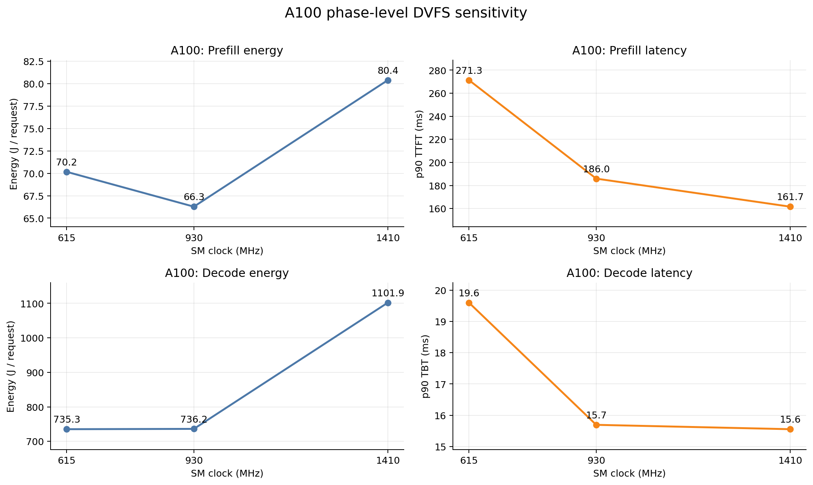

- Prefill：1410→930 MHz 时，能量从 80.39 降到 66.28 J/request，节省 17.6%；p90 TTFT 从 161.66 增至 185.97 ms，增加 15.0%。
- Decode：1410→930 MHz 时，能量从 1101.87 降到 736.18 J/request，节省 33.2%；p90 TBT 只从 15.55 增至 15.69 ms，增加 0.9%。
- 615 MHz 不是理想工作点：相较 930 MHz，它没有进一步降低能量，却明显恶化 prefill TTFT 和 decode TBT。

这组结果说明 A100 decode 存在明显的低压频“甜点”，930 MHz 在当前负载下接近能耗与 TBT 的折中点。

## 2. V100 相位级 DVFS

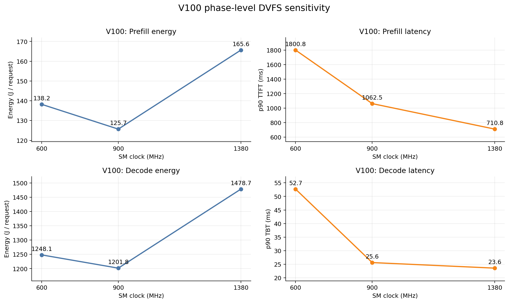

- Prefill：1380→900 MHz 时，能量从 165.64 降到 125.68 J/request，节省 24.1%；p90 TTFT 从 710.81 增至 1062.49 ms，增加 49.5%。
- Decode：1380→900 MHz 时，能量从 1478.70 降到 1201.77 J/request，节省 18.7%；p90 TBT 从 23.59 增至 25.63 ms，增加 8.7%。
- 600 MHz 同样被 900 MHz 支配：能量更高，且 TTFT/TBT 更差。

V100 也适合相位级 DVFS，但对降频更敏感；若 SLO 较紧，900 MHz 是否可用必须按请求类型判断。

## 3. 等资源架构的每请求能耗

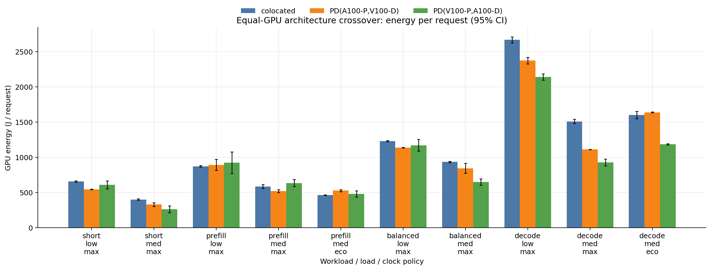

每个架构都占用同一组 A100+V100，误差棒是两次重复得到的 95% bootstrap CI。PD 在不少单元中比 colocated 低，但并非始终如此；不同 prefill/decode 角色分配也会改变能耗排序。

例如 `decode_medium_max` 中，PD(V100-P,A100-D) 为 925.68 J/request，低于 colocated 的 1508.81 J/request；但 `prefill_medium_eco` 中，PD(A100-P,V100-D) 为 527.12 J/request，高于 colocated 的 462.83 J/request。能耗优势必须逐 workload、负载和频率策略判断。

## 4. PD 相对 colocated 的能耗变化

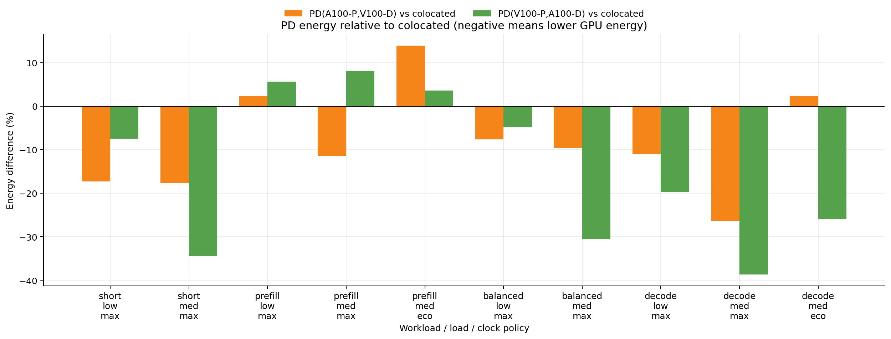

- 20 个 PD–colocated 配对中有 14 个仅看 GPU J/request 时显示 PD 更省能。
- 最大表面节能出现在 `decode_medium_max` 的 PD(V100-P,A100-D)，相对 colocated 降低 38.7%。
- 最大能耗劣化出现在 `prefill_medium_eco` 的 PD(A100-P,V100-D)，增加 13.9%。

负值只说明请求窗口内两张 GPU 的积分能量更低，不代表配置满足延迟 SLO。由于 host-staged 路径消耗的主机能量未计入，这里的 PD 节能还是偏乐观估计。

## 5. 每输出 token 能耗

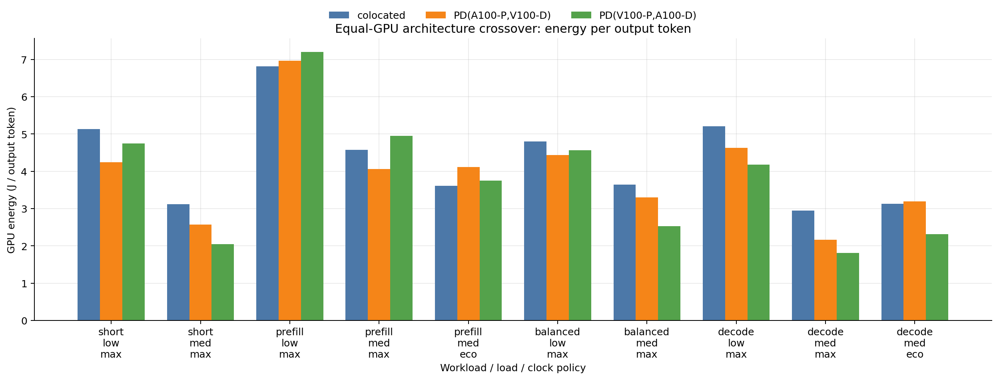

同一 case 的三种架构生成相同数量的 token，因此图中的架构内排序与 J/request 一致，但该指标可以消除不同 workload 输出长度的影响。未加 SLO 时，最低点之一是 `decode_medium_max` 的 PD(V100-P,A100-D)：1.81 J/output token；对应 colocated 为 2.95 J/output token。

Prefill-heavy case 的 J/output token 较高，原因是输入很长而输出 token 少；这不应被解释为 prefill 单 token 计算本身更低效。

## 6. p90 TTFT

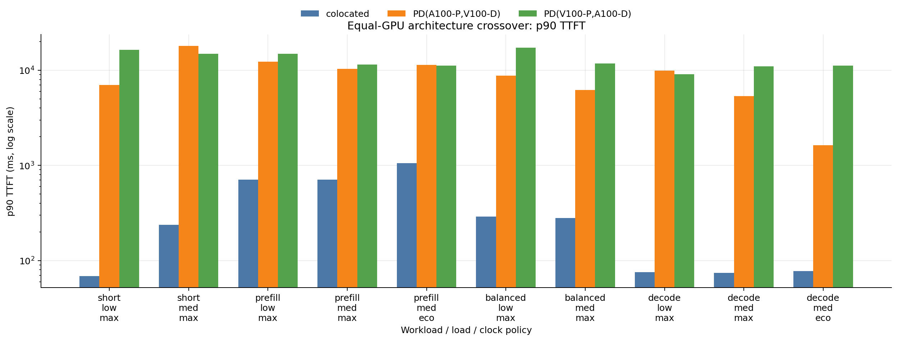

纵轴采用对数尺度。Colocated 的 p90 TTFT 为 68.80–1058.87 ms；两种 PD 角色分配为 1634.41–17945.10 ms。在对应 case 中，PD 的 TTFT 约为 colocated 的 10–250 倍。

这说明本机 PD 的主要瓶颈不是 decode，而是无 P2P 时 KV 经主机路径传输造成的首 token 延迟。能耗较低的 PD 点因 TTFT 大幅右移，不能直接成为 SLO 下的候选。

## 7. p90 TBT

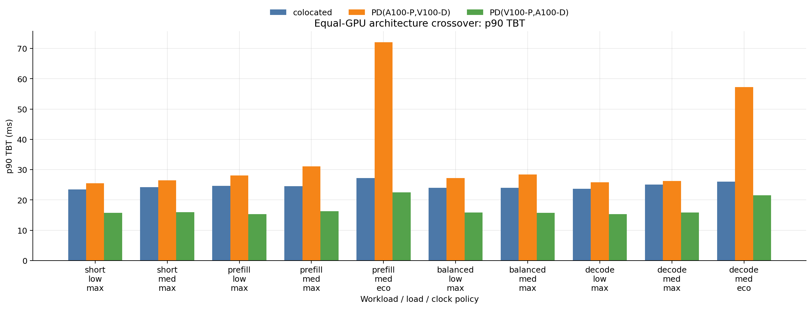

- A100 负责 decode 的 PD(V100-P,A100-D) 的 p90 TBT 为 15.28–22.51 ms，通常优于 colocated 的 23.49–27.27 ms。
- V100 负责 decode 的 PD(A100-P,V100-D) 在 max clock 下多为 25.46–31.09 ms；eco decode 进一步升至 57.22–72.05 ms。

TBT 主要受 decode GPU 与其频率影响。A100 decode 可以改善 token 间延迟，但无法抵消 host-staged KV 传输造成的 TTFT 失败。

## 8. 请求吞吐

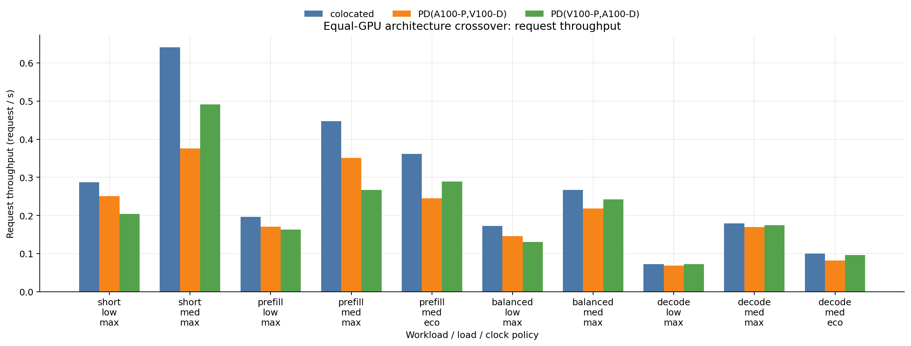

Colocated 在所有测试 case 中均取得最高请求吞吐。差距在短输出、中负载时最明显：`short_medium_max` 的 colocated 为 0.641 request/s，PD(A100-P,V100-D) 和 PD(V100-P,A100-D) 分别为 0.376 和 0.491 request/s。

当前 PD 并未通过并行化换来更高吞吐，因为 host-staged 传输和串联的 prefill→decode 路径抵消了分离带来的阶段并行收益。

## 9. Energy–TTFT 权衡

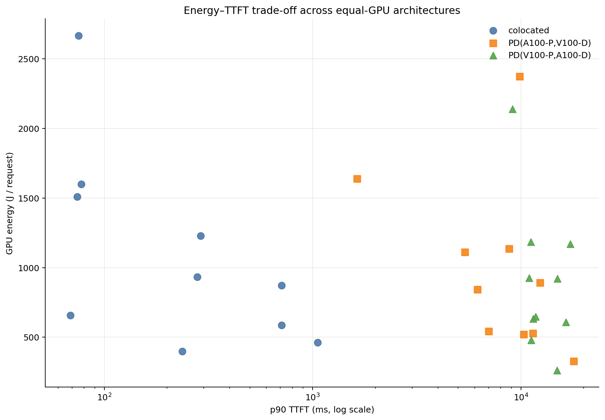

散点图把“只看能耗会选中的 PD 点”和“低 TTFT 的 colocated 点”放在同一坐标系中。PD 的部分点确实更低，但整体位于图的右侧；colocated 构成了当前 TTFT SLO 可接受区域内的有效前沿。

因此，本机不存在“同时降低 GPU 能耗并保持 TTFT”的 PD crossover。这里应选择 colocated，而不是从低能耗 PD 点中挑选。

## 10. 90% TTFT+TBT 双 SLO 可行性

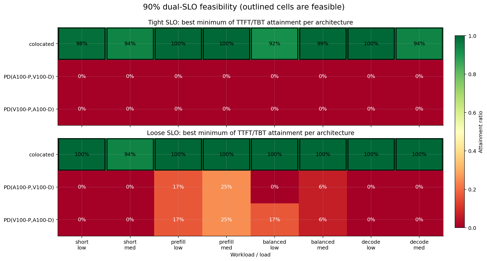

每个格子取该架构在对应 workload/load 下所有频率策略中 `min(TTFT attainment, TBT attainment)` 的最大值；黑框表示达到 90% 双 SLO。

- Tight SLO 下，colocated 的最弱一项 attainment 为 92%–100%，8 个单元全部可行；两种 PD 均为 0%，原因是 TTFT attainment 为 0。
- Loose SLO 下，colocated 为 94%–100%，仍全部可行；PD 的最佳值最多只有 25%，离 90% 仍很远。
- 放宽 SLO 不能修复数量级的传输延迟，当前互连条件下没有可行 PD 单元。

## 11. SLO 可行配置中的能耗赢家

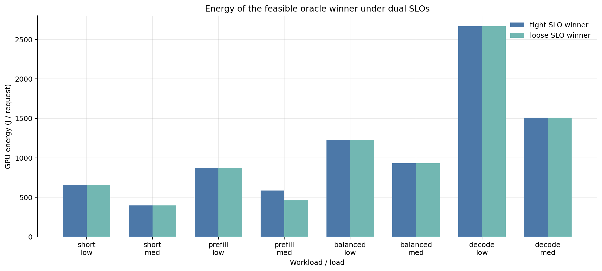

16 个 workload/load/SLO 单元的赢家全部是 colocated。Tight 与 loose 柱大多重合，因为同一个 max-clock colocated 配置获胜；唯一明显变化是 `prefill_medium`：loose SLO 允许选择 colocated eco，从 586.13 降至 462.83 J/request，节省 21.0%。

这也说明 selective 策略不应只有“colocated 或 PD”一个动作维度。即使选择 colocated，仍可继续按 workload 和 SLO 选择相位频率。

## 最终结论

1. **相位级 DVFS 是本机可兑现的节能手段。** A100 decode 在 930 MHz 可节省 33.2% GPU 能量而 p90 TBT 只增加 0.9%；V100 decode 在 900 MHz 可节省 18.7%，TBT 增加 8.7%。
2. **能耗目标不能脱离双 SLO。** 14/20 个 PD 配对在纯 GPU 能量上更低，但加入 90% TTFT+TBT 约束后，可行 PD 数量从 14 个表面优势点降为 0。
3. **当前 selective PD 的正确决策是“不分离”。** 本机 A100/V100 无 CUDA P2P，NIXL host-staged/TCP 使 PD TTFT 达到 1.6–17.9 秒；colocated 在全部 tight/loose 单元中可行并成为能耗赢家。
4. **Decode 放在 A100 上能改善 TBT，但不能解决 TTFT。** 这验证了阶段异构映射的潜力，也表明互连能力必须先于算力匹配进入选择器。
5. **结论只适用于弱互连/无 P2P 区域。** 它不能外推为“PD 普遍无效”。下一组实验应使用同代、P2P 可用或 NVLink/RDMA GPU，至少五次重复并覆盖更多负载，才能寻找真正的 PD crossover。

## 复现图片

在容器 `/workspace` 下执行：

```bash
PYTHONPATH=/workspace python -m experiments.selective_pd.plot_results
```

图片输出到 `results/figures/`，原始报告和聚合表保持不变。
